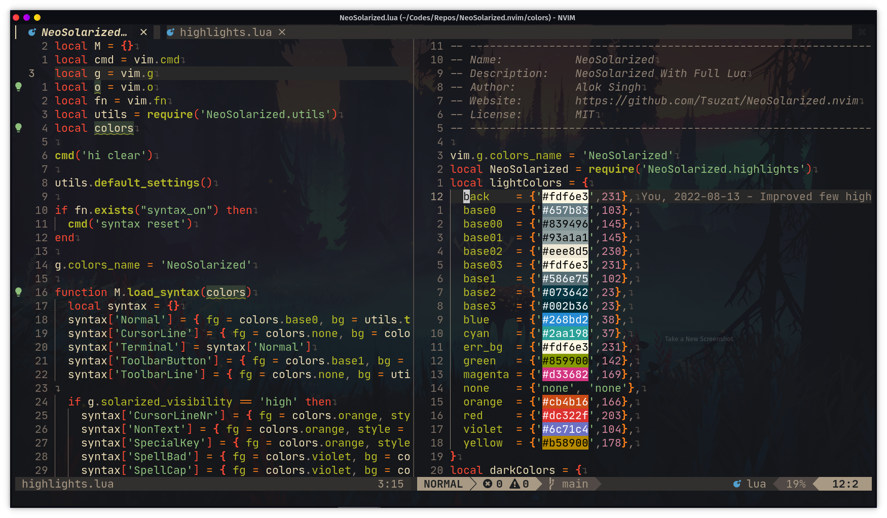

<!--toc:start-->
  - [Lunarch](#lunarch)
  - [Required](#required)
  - [Color Scheme](#color-scheme)
  - [Preview](#preview)
    - gruvbox-material (star theme)
    - NeoSolarized
<!--toc:end-->
## Lunarch
A fast and beautiful configuration for Neovim; 100% Written in Lua. This project is written mainly for gruvbox theme lover. Everything is customised according to gruvbox-material. Everything has been made transparent. 

### Required
- Neovim v0.7
- Python and pip
- Nodejs, npm and yarn (for Lsp and more plugins)
- [JetBrainsMono Nerd Font](https://github.com/ryanoasis/nerd-fonts/releases/download/v2.1.0/JetBrainsMono.zip)

### Color Scheme
My obsession with [gruvbox-material](https://github.com/sainnhe/gruvbox-material) has made this project an art. Almost everything has been made transparent and beautiful.
Alternatively, one can use NeoSolarized color-scheme which is optimised for full transparency.

### Preview
System
- Arch based distro [Garuda Linux](https://garudalinux.org/downloads.html)
- Terminal Emulator [Kitty](https://github.com/kovidgoyal/kitty)
- Shell : Fish

#### [NeoSolarized](https://github.com/Tsuzat/NeoSolarized.nvim)

#### gruvbox-material

