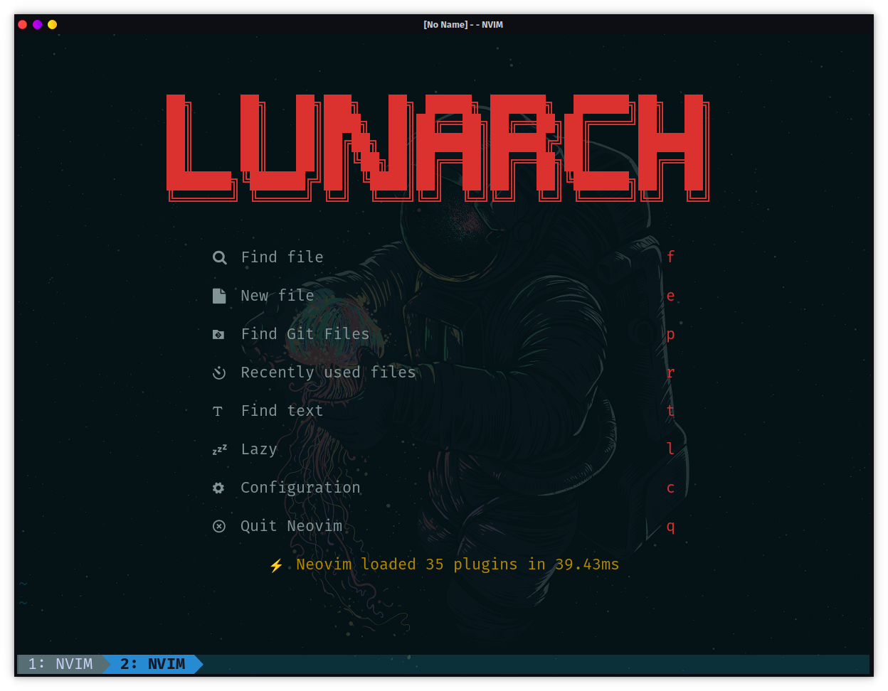
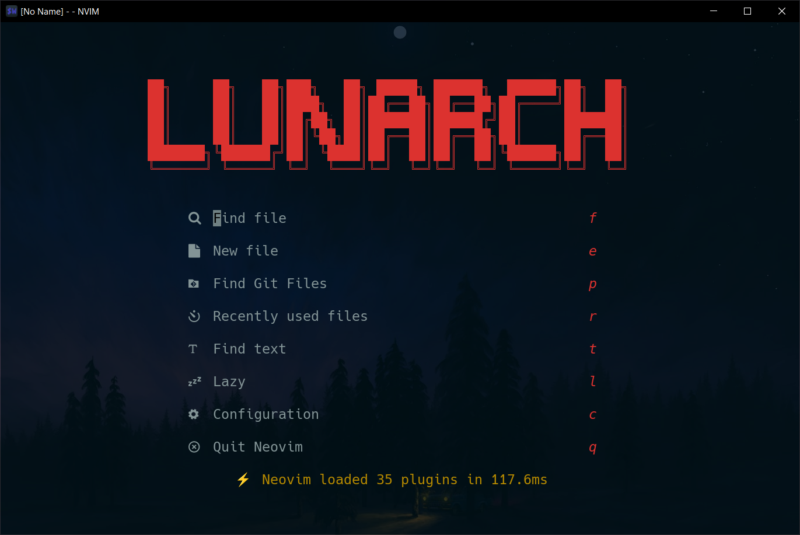

## Lunarch
A blazing fast and beautiful configuration for Neovim; 100% Written in Lua. This project is written mainly for transparent theme lover. Everything has been made transparent.

### Required
- Neovim v0.7
- Python and pip
- Nodejs, npm and yarn (for Lsp and more plugins)
- [FiraCode Nerd Font](https://github.com/ryanoasis/nerd-fonts)

### Color Scheme
My obsession with transparency has made this project an art. Almost everything has been made transparent and beautiful.
Default theme is [`NeoSolarized.nvim`](https://github.com/Tsuzat/NeoSolarized.nvim)

### Preview
System **Linux**
- Arch based distro [Garuda Linux](https://garudalinux.org/downloads.html)
- Terminal Emulator [Kitty](https://github.com/kovidgoyal/kitty)
- Shell : Fish
- Loading time is about 40-50 ms

 

System **Windows**
- Windows 10
- Terminal Emulator [`Wezterm`](https://github.com/wez/wezterm)
- Shell : Powershell
- Loading time is about 120-150 ms.

 
